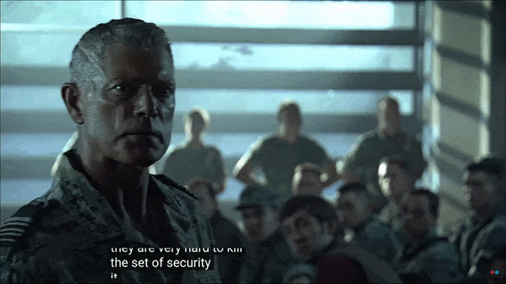

[← Zpět](../../index.html){.back-button}

# 6. semestr

Letní semestr 2024/2025

## Předměty

| Předmět | Numerická matematika |
| --- | --- |
| Soubor | [Zápisky z hodin [pdf]](predmety/numerika.pdf) |
| Zdroják | [Zdrojak](predmety/numerika.zip) |
| Poznámka | Zápisky byly převedeny z ručně psaných poznámek do TeXu za pomoci AI. Něco chybí, někde jsou chyby a vím o nich. Takže bacha :) . |

| Předmět | Automaty a gramatiky | Diskrétní a spojitá optimalizace |
| --- | --- | --- |
| Anki | [Anki](predmety/TočímeMaty.apkg)  | [Anki - diskrétní + spojitá část](predmety/DSO.apkg) |
| Soubory + Odkazy | [Celý text k přednášce](predmety/TocimeMaty.pdf)| [příprava na zkoušku diskrétní část](https://dominik.whizzmot.dev/notes/disco/), [poznámky diskrétní část](https://slama.dev/assets/diskretni-a-spojita-optimalizace.pdf), [skripta spojitá část](https://kam.mff.cuni.cz/~hladik/DSO/text_dso.pdf) |
| Poznámka | Anki: Matěj Prokopič | Anki: Matěj Prokopič + Lukáš Veškrna |

*DSO ve třeťáku s jediným šibeničním termínem před státnicema be like:*
